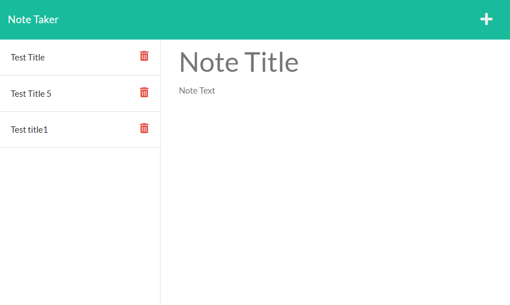

# Note Taker Starter Code

## Description

This is the 'Module 11' challenge assignment for the UCF coding bootcamp.

Based on the starter code we were given, we were tasked with adding to a back end using express.js methods. This project helps to build our skills with using said express methods to get more familiar with them.

## Installation

1. Git clone repo into VSCode
2. Right click `server.js` file and select `Open in Integrated Terminal`
3. Run `npm i`
4. Run `npm i express`
5. Run `npm i jest`
6. Run `heroku create`
7. Run `git push heroku main`

## Usage

In the terminal, run `heroku open`. Doing so will direct you to your deployed application of the Note Taker.

Once inside the application, you will be greeted by a homepage.
- Click the *Get Started* button to continue

Once you are at the main page:
- Clicking the `Note Title` textbox on the righthand side will allow you to write a note title
- Clicking the `Note Text` textbox on the righthand side will allow you to write the note description
- After writing a note, a *save icon* will appear in the top right corner. Clicking it will save your note
- A *create icon* will always be present in the top right corner. Clicking it will clear the textboxes, allowing you to create a new note from scratch.
- Clicking any one of the saved notes on the lefthand side will pull up the contents of a previous note

**Heads Up!** The *delete icon* wasn't implemented in this build. Clicking on it won't cause any changes to occur.

[Demo](https://drive.google.com/file/d/1JodwnZ_2eSbFy6e7hIGN4CSbx6zwY6KU/view)